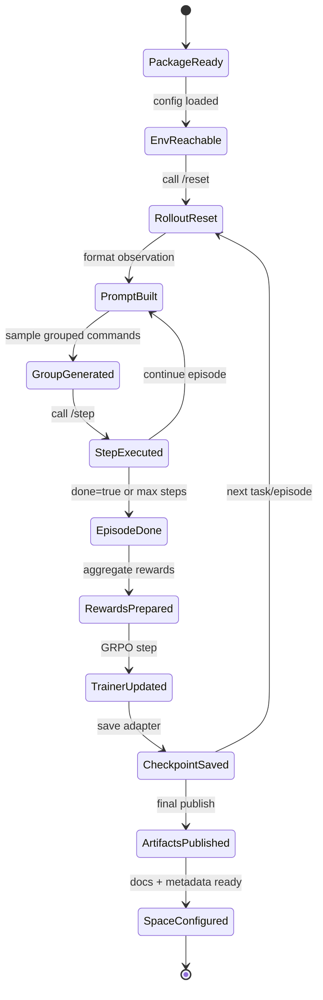
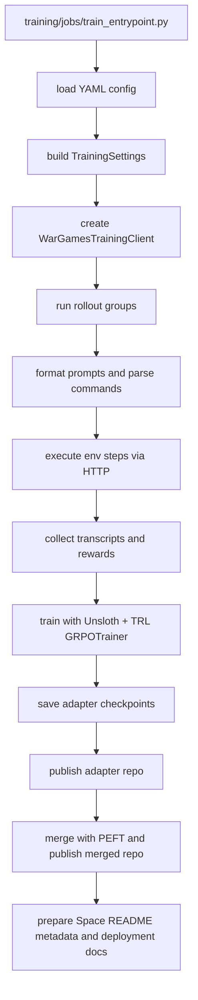

# WarGames Training Implementation Plan

> **For agentic workers:** REQUIRED SUB-SKILL: Use superpowers:subagent-driven-development (recommended) or superpowers:executing-plans to implement this plan task-by-task. Steps use checkbox (`- [ ]`) syntax for tracking.

**Goal:** Build a self-contained `training/` package that runs Red-agent GRPO with Unsloth against the existing WarGames environment, publishes both LoRA and merged artifacts to Hugging Face, and provides Hugging Face Job and Space deployment assets.

**Architecture:** Keep the root WarGames environment as the only runtime source of truth. Add a top-level `training/` package that adapts `/reset`, `/step`, and `/state` into rollout, GRPO, publishing, and deployment workflows. Use Hugging Face Jobs for GPU training and Hugging Face Spaces for demo and evaluation.

**Tech Stack:** Python 3.12, FastAPI/OpenEnv runtime, httpx, pydantic, pytest, Unsloth, TRL GRPOTrainer, PEFT, huggingface_hub, Hugging Face Jobs, Hugging Face Spaces

---

## State Diagram



## Flow Diagram



## File Map

### Existing files to modify

- `pyproject.toml`
  Add optional training dependencies and package discovery for `training*`.
- `README.md`
  Add a short section pointing to `training/README.md` for GRPO and Hugging Face workflows.
- `.gitignore`
  Ignore `training/artifacts/` and local checkpoint output if not already ignored.

- `docs/superpowers/specs/2026-04-25-wargames-training-design.md`
  Reference-only design input for implementation.

### New files to create

- `training/__init__.py`
- `training/README.md`
- `training/config/training.base.yaml`
- `training/config/curriculum.l0-l4.yaml`
- `training/config/publish.yaml`
- `training/config/space.yaml`
- `training/prompts/red_system_prompt.txt`
- `training/env_adapter/client.py`
- `training/env_adapter/observation_formatter.py`
- `training/env_adapter/action_parser.py`
- `training/env_adapter/task_selector.py`
- `training/rollouts/trajectory.py`
- `training/rollouts/transcript_writer.py`
- `training/rollouts/episode_runner.py`
- `training/rollouts/sampler.py`
- `training/grpo/config.py`
- `training/grpo/model.py`
- `training/grpo/reward_adapter.py`
- `training/grpo/trainer.py`
- `training/jobs/train_entrypoint.py`
- `training/jobs/eval_entrypoint.py`
- `training/jobs/launch.md`
- `training/publish/model_card.py`
- `training/publish/push_adapter.py`
- `training/publish/push_merged.py`
- `training/spaces/README.template.md`
- `training/spaces/deployment.md`
- `training/spaces/runtime_env.md`
- `training/notebooks/colab_grpo.ipynb`
- `training/artifacts/.gitignore`

### New tests to create

- `tests/training/test_env_adapter.py`
- `tests/training/test_action_parser.py`
- `tests/training/test_rollouts.py`
- `tests/training/test_reward_adapter.py`
- `tests/training/test_training_config.py`
- `tests/training/test_publish.py`

## Task 1: Create the `training/` package skeleton and config contract

**Files:**
- Create: `training/__init__.py`
- Create: `training/README.md`
- Create: `training/config/training.base.yaml`
- Create: `training/config/curriculum.l0-l4.yaml`
- Create: `training/config/publish.yaml`
- Create: `training/config/space.yaml`
- Create: `training/artifacts/.gitignore`
- Create: `tests/training/test_training_config.py`
- Modify: `pyproject.toml`
- Modify: `README.md`
- Modify: `.gitignore`

- [ ] **Step 1: Write the failing config-loading tests**

```python
from pathlib import Path

import yaml


def test_training_base_config_declares_env_and_model_defaults():
    payload = yaml.safe_load(Path("training/config/training.base.yaml").read_text())

    assert payload["env"]["base_url"] == "http://localhost:8000"
    assert payload["model"]["base_model"] == "Qwen/Qwen2.5-7B-Instruct"
    assert payload["trainer"]["algorithm"] == "grpo"


def test_publish_config_declares_adapter_and_merged_targets():
    payload = yaml.safe_load(Path("training/config/publish.yaml").read_text())

    assert payload["adapter_repo_id"].endswith("wargames-red-lora")
    assert payload["merged_repo_id"].endswith("wargames-red-merged")


def test_space_config_declares_docker_sdk_and_app_port():
    payload = yaml.safe_load(Path("training/config/space.yaml").read_text())

    assert payload["sdk"] == "docker"
    assert payload["app_port"] == 8000
```

- [ ] **Step 2: Run test to verify it fails**

Run: `pytest tests/training/test_training_config.py -v`
Expected: FAIL with missing `training/config/*.yaml` files.

- [ ] **Step 3: Add the package skeleton and YAML configs**

```yaml
# training/config/training.base.yaml
env:
  base_url: http://localhost:8000
  healthcheck_path: /state
model:
  base_model: Qwen/Qwen2.5-7B-Instruct
  max_seq_length: 2048
  load_in_4bit: true
  lora_rank: 16
  lora_alpha: 16
  target_modules:
    - q_proj
    - k_proj
    - v_proj
    - o_proj
    - gate_proj
    - up_proj
    - down_proj
trainer:
  algorithm: grpo
  output_dir: training/artifacts/checkpoints
  learning_rate: 5.0e-6
  per_device_train_batch_size: 1
  gradient_accumulation_steps: 4
  num_generations: 4
  max_completion_length: 128
  temperature: 0.7
  beta: 0.001
  use_vllm: false
rollout:
  max_steps_per_episode: 10
  reward_aggregation: sum
```

```yaml
# training/config/curriculum.l0-l4.yaml
schedule:
  - until_step: 250
    tasks: [phase-2-blue-l0]
  - until_step: 500
    tasks: [phase-2-blue-l1]
  - until_step: 750
    tasks: [phase-2-blue-l2]
  - until_step: 1000
    tasks: [phase-2-blue-l3]
  - until_step: 1500
    tasks: [phase-2-blue-l4]
```

```yaml
# training/config/publish.yaml
adapter_repo_id: your-org/wargames-red-lora
merged_repo_id: your-org/wargames-red-merged
private: false
license: mit
```

```yaml
# training/config/space.yaml
title: WarGames Demo
emoji: "🛡️"
sdk: docker
app_port: 8000
space_repo_id: your-org/wargames-demo-space
artifact_mode: adapter
```

```gitignore
# training/artifacts/.gitignore
*
!.gitignore
```

- [ ] **Step 4: Register training dependencies and package discovery**

```toml
[project.optional-dependencies]
training = [
  "huggingface_hub>=0.35.1",
  "peft>=0.17.1",
  "pyyaml>=6.0.2",
  "torch>=2.8.0",
  "transformers>=4.56.1",
  "trl>=0.25.0",
  "unsloth>=2025.9.4",
]

[tool.setuptools.packages.find]
where = ["src", "."]
include = ["wargames_env*", "server*", "training*"]
namespaces = true
```

- [ ] **Step 5: Add root documentation pointers**

```markdown
## Training

GRPO training, Hugging Face Job launch steps, adapter publishing, merged-model export,
and Space deployment assets live under `training/`.

Start with `training/README.md`.
```

- [ ] **Step 6: Run tests to verify the config contract passes**

Run: `pytest tests/training/test_training_config.py -v`
Expected: PASS

- [ ] **Step 7: Commit**

```bash
git add pyproject.toml README.md .gitignore training tests/training/test_training_config.py
git commit -m "feat: scaffold training package contract"
```

## Task 2: Add the environment adapter, prompt formatter, and action parser

**Files:**
- Create: `training/env_adapter/client.py`
- Create: `training/env_adapter/observation_formatter.py`
- Create: `training/env_adapter/action_parser.py`
- Create: `training/env_adapter/task_selector.py`
- Create: `tests/training/test_env_adapter.py`
- Create: `tests/training/test_action_parser.py`

- [ ] **Step 1: Write failing adapter and parser tests**

```python
from training.env_adapter.action_parser import parse_model_command
from training.env_adapter.observation_formatter import build_red_prompt
from wargames_env.models import SystemMetrics, WarGamesObservation


def test_build_red_prompt_includes_metrics_task_and_output():
    obs = WarGamesObservation(
        command_output="ready",
        metrics=SystemMetrics(
            gateway_success_rate=0.9,
            gateway_p99_latency_ms=120.0,
            queue_depth=3,
            worker_restart_count=1,
            consumer_stall_count=0,
        ),
        process_status={"gateway": "running"},
        done=False,
        reward=0.1,
    )

    prompt = build_red_prompt(
        observation=obs,
        task_name="phase-2-blue-l2",
        step_num=2,
        attempt_history=[{"step": 1, "command": "date", "output": "ok", "error": None}],
    )

    assert "phase-2-blue-l2" in prompt
    assert "Gateway success rate" in prompt
    assert "LATEST COMMAND OUTPUT" in prompt


def test_parse_model_command_reads_json_and_falls_back_to_single_line():
    assert parse_model_command('{"command":"redis-cli LLEN job_queue"}') == "redis-cli LLEN job_queue"
    assert parse_model_command("curl localhost:3000/health") == "curl localhost:3000/health"
```

```python
from training.env_adapter.client import WarGamesTrainingClient


def test_task_selector_uses_stage_schedule():
    tasks = ["phase-2-blue-l0", "phase-2-blue-l1"]
    assert tasks[0].startswith("phase-2-blue")


def test_training_client_wraps_reset_step_and_state(monkeypatch):
    client = WarGamesTrainingClient("http://localhost:8000")
    monkeypatch.setattr(client._client, "post", lambda *args, **kwargs: None)
    monkeypatch.setattr(client._client, "get", lambda *args, **kwargs: None)

    assert client.base_url == "http://localhost:8000"
```

- [ ] **Step 2: Run tests to verify they fail**

Run: `pytest tests/training/test_env_adapter.py tests/training/test_action_parser.py -v`
Expected: FAIL with missing `training.env_adapter` modules.

- [ ] **Step 3: Implement the prompt formatter with existing env semantics**

```python
def build_red_prompt(observation, task_name, step_num, attempt_history):
    history_lines = []
    for attempt in attempt_history:
        history_lines.append(
            f"- step {attempt['step']}: command={attempt['command']}; error={attempt['error'] or 'none'}"
        )
    history = "\n".join(history_lines) or "- none"
    return (
        f"Step {step_num}.\n\n"
        f"TASK: {task_name}\n"
        f"METRICS:\n"
        f"- Gateway success rate: {observation.metrics.gateway_success_rate:.1%}\n"
        f"- Gateway P99 latency: {observation.metrics.gateway_p99_latency_ms:.0f}ms\n"
        f"- Queue depth: {observation.metrics.queue_depth}\n"
        f"SERVICE STATUS:\n{observation.process_status}\n\n"
        f"PREVIOUS ATTEMPTS:\n{history}\n\n"
        f"LATEST COMMAND OUTPUT:\n{observation.command_output[:2000]}\n\n"
        'Return exactly one bash command as JSON: {"command":"<bash command>"}.'
    )
```

- [ ] **Step 4: Implement the parser and HTTP client wrapper**

```python
import json

import httpx

from wargames_env.models import StepResult, WarGamesAction, WarGamesObservation, WarGamesState


def parse_model_command(text: str) -> str:
    stripped = text.strip()
    if not stripped:
        return "echo NO_COMMAND_PROVIDED"
    try:
        payload = json.loads(stripped)
    except json.JSONDecodeError:
        return stripped.splitlines()[0].strip()
    if isinstance(payload, dict) and isinstance(payload.get("command"), str):
        command = payload["command"].strip()
        return command or "echo NO_COMMAND_PROVIDED"
    return "echo NO_COMMAND_PROVIDED"


class WarGamesTrainingClient:
    def __init__(self, base_url: str) -> None:
        self.base_url = base_url.rstrip("/")
        self._client = httpx.Client(base_url=self.base_url, timeout=45.0)

    def reset(self, task_name: str) -> WarGamesObservation:
        response = self._client.post("/reset", params={"task_name": task_name})
        response.raise_for_status()
        return WarGamesObservation.model_validate(response.json())

    def step(self, command: str) -> StepResult:
        response = self._client.post("/step", json=WarGamesAction(command=command).model_dump())
        response.raise_for_status()
        return StepResult.model_validate(response.json())

    def state(self) -> WarGamesState:
        response = self._client.get("/state")
        response.raise_for_status()
        return WarGamesState.model_validate(response.json())
```

- [ ] **Step 5: Add a staged task selector**

```python
def select_curriculum_tasks(schedule: list[dict], trainer_step: int) -> list[str]:
    for stage in schedule:
        if trainer_step <= int(stage["until_step"]):
            return [str(task) for task in stage["tasks"]]
    return [str(task) for task in schedule[-1]["tasks"]]
```

- [ ] **Step 6: Run the adapter and parser tests**

Run: `pytest tests/training/test_env_adapter.py tests/training/test_action_parser.py -v`
Expected: PASS

- [ ] **Step 7: Commit**

```bash
git add training/env_adapter tests/training/test_env_adapter.py tests/training/test_action_parser.py
git commit -m "feat: add training env adapter and parser"
```

## Task 3: Add rollout trajectories, transcript writing, and reward aggregation

**Files:**
- Create: `training/rollouts/trajectory.py`
- Create: `training/rollouts/transcript_writer.py`
- Create: `training/rollouts/episode_runner.py`
- Create: `training/rollouts/sampler.py`
- Create: `training/grpo/reward_adapter.py`
- Create: `tests/training/test_rollouts.py`
- Create: `tests/training/test_reward_adapter.py`

- [ ] **Step 1: Write failing rollout tests**

```python
from training.grpo.reward_adapter import aggregate_episode_reward
from training.rollouts.episode_runner import run_episode


def test_aggregate_episode_reward_sums_step_rewards():
    assert aggregate_episode_reward([0.1, 0.2, 0.3], method="sum") == 0.6


def test_run_episode_returns_steps_rewards_and_transcript(fake_training_client, fake_llm):
    result = run_episode(
        llm_client=fake_llm,
        env_client=fake_training_client,
        task_name="phase-2-blue-l0",
        max_steps=2,
    )

    assert result.task_name == "phase-2-blue-l0"
    assert len(result.steps) == 2
    assert len(result.rewards) == 2
```

- [ ] **Step 2: Run tests to verify they fail**

Run: `pytest tests/training/test_rollouts.py tests/training/test_reward_adapter.py -v`
Expected: FAIL with missing rollout modules.

- [ ] **Step 3: Add typed trajectory models and reward aggregation**

```python
from dataclasses import dataclass


@dataclass
class RolloutStep:
    step_num: int
    prompt: str
    raw_completion: str
    command: str
    reward: float
    done: bool
    info: dict


@dataclass
class EpisodeTrajectory:
    task_name: str
    steps: list[RolloutStep]
    rewards: list[float]


def aggregate_episode_reward(rewards: list[float], method: str = "sum") -> float:
    if not rewards:
        return 0.0
    if method == "last":
        return float(rewards[-1])
    return float(sum(rewards))
```

- [ ] **Step 4: Implement episode execution and transcript output**

```python
def run_episode(llm_client, env_client, task_name: str, max_steps: int):
    observation = env_client.reset(task_name)
    steps = []
    rewards = []
    history = []
    for step_num in range(1, max_steps + 1):
        prompt = build_red_prompt(observation, task_name, step_num, history)
        raw_completion = llm_client.generate(prompt)
        command = parse_model_command(raw_completion)
        result = env_client.step(command)
        steps.append(
            RolloutStep(
                step_num=step_num,
                prompt=prompt,
                raw_completion=raw_completion,
                command=command,
                reward=result.reward,
                done=result.done,
                info=result.info,
            )
        )
        rewards.append(result.reward)
        history.append({"step": step_num, "command": command, "output": result.observation.command_output, "error": result.info.get("error")})
        observation = result.observation
        if result.done:
            break
    return EpisodeTrajectory(task_name=task_name, steps=steps, rewards=rewards)
```

```python
import json
from pathlib import Path


def write_transcript(path: Path, episode) -> None:
    payload = {
        "task_name": episode.task_name,
        "rewards": episode.rewards,
        "steps": [step.__dict__ for step in episode.steps],
    }
    path.parent.mkdir(parents=True, exist_ok=True)
    path.write_text(json.dumps(payload, indent=2), encoding="utf-8")
```

- [ ] **Step 5: Implement grouped sampling for GRPO**

```python
def sample_grouped_episodes(llm_client, env_client, task_name: str, max_steps: int, group_size: int):
    return [
        run_episode(llm_client=llm_client, env_client=env_client, task_name=task_name, max_steps=max_steps)
        for _ in range(group_size)
    ]
```

- [ ] **Step 6: Run the rollout and reward adapter tests**

Run: `pytest tests/training/test_rollouts.py tests/training/test_reward_adapter.py -v`
Expected: PASS

- [ ] **Step 7: Commit**

```bash
git add training/rollouts training/grpo/reward_adapter.py tests/training/test_rollouts.py tests/training/test_reward_adapter.py
git commit -m "feat: add training rollout pipeline"
```

## Task 4: Add Unsloth model loading and TRL GRPO trainer wiring

**Files:**
- Create: `training/grpo/config.py`
- Create: `training/grpo/model.py`
- Create: `training/grpo/trainer.py`
- Create: `tests/training/test_training_config.py`

- [ ] **Step 1: Extend tests to cover trainer config mapping**

```python
from training.grpo.config import build_grpo_config


def test_build_grpo_config_maps_yaml_to_trl_settings():
    payload = {
        "trainer": {
            "output_dir": "training/artifacts/checkpoints",
            "learning_rate": 5e-6,
            "per_device_train_batch_size": 1,
            "gradient_accumulation_steps": 4,
            "num_generations": 4,
            "max_completion_length": 128,
            "temperature": 0.7,
            "beta": 0.001,
            "use_vllm": False,
        }
    }

    config = build_grpo_config(payload)

    assert config.output_dir == "training/artifacts/checkpoints"
    assert config.num_generations == 4
    assert config.max_completion_length == 128
```

- [ ] **Step 2: Run the targeted test to verify failure**

Run: `pytest tests/training/test_training_config.py::test_build_grpo_config_maps_yaml_to_trl_settings -v`
Expected: FAIL with missing `training.grpo.config` module.

- [ ] **Step 3: Implement Unsloth model loading**

```python
from unsloth import FastLanguageModel, PatchFastRL


def load_training_model(settings: dict):
    PatchFastRL(algorithm="grpo", FastLanguageModel=FastLanguageModel)
    model, tokenizer = FastLanguageModel.from_pretrained(
        model_name=settings["model"]["base_model"],
        max_seq_length=settings["model"]["max_seq_length"],
        load_in_4bit=settings["model"]["load_in_4bit"],
        fast_inference=settings["trainer"]["use_vllm"],
    )
    model = FastLanguageModel.get_peft_model(
        model,
        r=settings["model"]["lora_rank"],
        target_modules=settings["model"]["target_modules"],
        lora_alpha=settings["model"]["lora_alpha"],
        lora_dropout=0,
        bias="none",
        use_gradient_checkpointing="unsloth",
    )
    return model, tokenizer
```

- [ ] **Step 4: Implement TRL GRPO config and trainer builder**

```python
from trl import GRPOConfig, GRPOTrainer


def build_grpo_config(settings: dict) -> GRPOConfig:
    trainer = settings["trainer"]
    return GRPOConfig(
        output_dir=trainer["output_dir"],
        learning_rate=trainer["learning_rate"],
        per_device_train_batch_size=trainer["per_device_train_batch_size"],
        gradient_accumulation_steps=trainer["gradient_accumulation_steps"],
        num_generations=trainer["num_generations"],
        max_completion_length=trainer["max_completion_length"],
        temperature=trainer["temperature"],
        beta=trainer["beta"],
        use_vllm=trainer["use_vllm"],
        report_to="none",
    )


def build_trainer(model, tokenizer, dataset, reward_funcs, rollout_func, settings: dict) -> GRPOTrainer:
    return GRPOTrainer(
        model=model,
        processing_class=tokenizer,
        train_dataset=dataset,
        reward_funcs=reward_funcs,
        rollout_func=rollout_func,
        args=build_grpo_config(settings),
    )


def build_prompt_dataset(tasks: list[str]) -> list[dict[str, str]]:
    return [{"task_name": task_name, "prompt": task_name} for task_name in tasks]


def reward_from_rollout(completions, trajectories, **kwargs):
    return [aggregate_episode_reward(trajectory.rewards, method="sum") for trajectory in trajectories]


class LocalGenerationClient:
    def __init__(self, model, tokenizer) -> None:
        self.model = model
        self.tokenizer = tokenizer

    def generate(self, prompt: str) -> str:
        messages = [{"role": "user", "content": prompt}]
        text = self.tokenizer.apply_chat_template(messages, tokenize=False, add_generation_prompt=True)
        return text


def make_rollout_func(llm_client, env_client, max_steps: int):
    def rollout_func(batch_prompts, **kwargs):
        trajectories = []
        for item in batch_prompts:
            task_name = item["task_name"] if isinstance(item, dict) else str(item)
            trajectories.append(
                run_episode(
                    llm_client=llm_client,
                    env_client=env_client,
                    task_name=task_name,
                    max_steps=max_steps,
                )
            )
        return trajectories

    return rollout_func
```

- [ ] **Step 5: Run the trainer config tests**

Run: `pytest tests/training/test_training_config.py -v`
Expected: PASS

- [ ] **Step 6: Commit**

```bash
git add training/grpo tests/training/test_training_config.py
git commit -m "feat: wire unsloth grpo trainer"
```

## Task 5: Add Hugging Face Job entrypoints and launch documentation

**Files:**
- Create: `training/jobs/train_entrypoint.py`
- Create: `training/jobs/eval_entrypoint.py`
- Create: `training/jobs/launch.md`
- Create: `training/prompts/red_system_prompt.txt`
- Modify: `training/README.md`

- [ ] **Step 1: Write the failing entrypoint smoke test**

```python
from pathlib import Path


def test_train_entrypoint_exists_and_references_training_base_config():
    text = Path("training/jobs/train_entrypoint.py").read_text()

    assert "training/config/training.base.yaml" in text
    assert "HF_TOKEN" in text
```

- [ ] **Step 2: Run the smoke test to verify failure**

Run: `pytest tests/training/test_training_config.py::test_train_entrypoint_exists_and_references_training_base_config -v`
Expected: FAIL with missing file.

- [ ] **Step 3: Implement the training job entrypoint**

```python
import os
from pathlib import Path

import yaml


def main() -> None:
    config_path = Path(os.getenv("TRAINING_CONFIG", "training/config/training.base.yaml"))
    curriculum_path = Path(os.getenv("CURRICULUM_CONFIG", "training/config/curriculum.l0-l4.yaml"))
    settings = yaml.safe_load(config_path.read_text())
    curriculum = yaml.safe_load(curriculum_path.read_text())
    hf_token = os.getenv("HF_TOKEN")
    if not hf_token:
        raise RuntimeError("HF_TOKEN is required for Hugging Face Jobs")
    env_client = WarGamesTrainingClient(settings["env"]["base_url"])
    model, tokenizer = load_training_model(settings)
    llm_client = LocalGenerationClient(model=model, tokenizer=tokenizer)
    tasks = select_curriculum_tasks(curriculum["schedule"], trainer_step=0)
    trainer = build_trainer(
        model=model,
        tokenizer=tokenizer,
        dataset=build_prompt_dataset(tasks),
        reward_funcs=[reward_from_rollout],
        rollout_func=make_rollout_func(
            llm_client=llm_client,
            env_client=env_client,
            max_steps=settings["rollout"]["max_steps_per_episode"],
        ),
        settings=settings,
    )
    trainer.train()
```

- [ ] **Step 4: Add the Hugging Face Jobs launch doc**

```markdown
## Launch training on Hugging Face Jobs

```bash
hf jobs uv run \
  --flavor a100-large \
  --timeout 6h \
  --with "./[training]" \
  --secrets HF_TOKEN \
  python training/jobs/train_entrypoint.py
```

Set `TRAINING_CONFIG` if you want a non-default YAML file.
```

- [ ] **Step 5: Add an evaluation job entrypoint**

```python
import os
from pathlib import Path

import yaml


def main() -> None:
    config_path = Path(os.getenv("TRAINING_CONFIG", "training/config/training.base.yaml"))
    settings = yaml.safe_load(config_path.read_text())
    env_client = WarGamesTrainingClient(settings["env"]["base_url"])
    model, tokenizer = load_training_model(settings)
    llm_client = LocalGenerationClient(model=model, tokenizer=tokenizer)
    episode = run_episode(
        llm_client=llm_client,
        env_client=env_client,
        task_name="phase-2-blue-l4",
        max_steps=settings["rollout"]["max_steps_per_episode"],
    )
    write_transcript(Path("training/artifacts/eval/latest.json"), episode)
```

- [ ] **Step 6: Run the smoke test again**

Run: `pytest tests/training/test_training_config.py::test_train_entrypoint_exists_and_references_training_base_config -v`
Expected: PASS

- [ ] **Step 7: Commit**

```bash
git add training/jobs training/prompts/red_system_prompt.txt training/README.md
git commit -m "feat: add hugging face job entrypoints"
```

## Task 6: Add artifact publishing for adapter and merged model outputs

**Files:**
- Create: `training/publish/model_card.py`
- Create: `training/publish/push_adapter.py`
- Create: `training/publish/push_merged.py`
- Create: `tests/training/test_publish.py`

- [ ] **Step 1: Write failing publishing tests**

```python
from training.publish.model_card import build_model_card_text


def test_model_card_mentions_base_model_and_artifact_kind():
    text = build_model_card_text(
        repo_id="your-org/wargames-red-lora",
        base_model="Qwen/Qwen2.5-7B-Instruct",
        artifact_kind="adapter",
    )

    assert "Qwen/Qwen2.5-7B-Instruct" in text
    assert "adapter" in text
```

- [ ] **Step 2: Run tests to verify failure**

Run: `pytest tests/training/test_publish.py -v`
Expected: FAIL with missing publish modules.

- [ ] **Step 3: Implement model card generation and adapter upload**

```python
from huggingface_hub import HfApi


def build_model_card_text(repo_id: str, base_model: str, artifact_kind: str) -> str:
    return (
        f"# {repo_id}\n\n"
        f"Artifact kind: {artifact_kind}\n\n"
        f"Base model: `{base_model}`\n\n"
        "Trained on the WarGames GRPO curriculum against the scripted Blue defender.\n"
    )


def push_adapter(repo_id: str, folder_path: str, private: bool = False):
    api = HfApi()
    api.create_repo(repo_id=repo_id, repo_type="model", private=private, exist_ok=True)
    return api.upload_folder(repo_id=repo_id, folder_path=folder_path)
```

- [ ] **Step 4: Implement merged-model export via PEFT**

```python
from peft import PeftModel
from transformers import AutoModelForCausalLM, AutoTokenizer


def export_merged_model(base_model: str, adapter_path: str, output_dir: str) -> str:
    model = AutoModelForCausalLM.from_pretrained(base_model)
    peft_model = PeftModel.from_pretrained(model, adapter_path)
    merged = peft_model.merge_and_unload()
    merged.save_pretrained(output_dir)
    AutoTokenizer.from_pretrained(base_model).save_pretrained(output_dir)
    return output_dir
```

- [ ] **Step 5: Run publish tests**

Run: `pytest tests/training/test_publish.py -v`
Expected: PASS

- [ ] **Step 6: Commit**

```bash
git add training/publish tests/training/test_publish.py
git commit -m "feat: add training artifact publishing"
```

## Task 7: Add Space metadata templates and deployment documentation

**Files:**
- Create: `training/spaces/README.template.md`
- Create: `training/spaces/deployment.md`
- Create: `training/spaces/runtime_env.md`
- Modify: `training/README.md`

- [ ] **Step 1: Write the failing template smoke test**

```python
from pathlib import Path


def test_space_readme_template_declares_docker_sdk_and_app_port():
    text = Path("training/spaces/README.template.md").read_text()

    assert "sdk: docker" in text
    assert "app_port: 8000" in text
```

- [ ] **Step 2: Run the smoke test to verify failure**

Run: `pytest tests/training/test_publish.py::test_space_readme_template_declares_docker_sdk_and_app_port -v`
Expected: FAIL with missing template.

- [ ] **Step 3: Add the Space README template**

```markdown
---
title: WarGames Demo
emoji: "🛡️"
colorFrom: red
colorTo: gray
sdk: docker
app_port: 8000
pinned: false
---

# WarGames Demo Space

This Space hosts the WarGames environment demo and evaluation flow.

- Artifact mode: `adapter` or `merged`
- Model repo: set via `MODEL_REPO_ID`
- Base model: set via `BASE_MODEL_NAME` when using adapter mode
```

- [ ] **Step 4: Add deployment documentation with explicit secret requirements**

```markdown
## Required Space secrets

- `HF_TOKEN`
- `MODEL_REPO_ID`
- `BASE_MODEL_NAME` when `artifact_mode=adapter`

## Deployment flow

1. Push or sync the Space repo.
2. Copy `training/spaces/README.template.md` to the Space README.
3. Set the required secrets in Space settings.
4. Confirm the runtime listens on port `8000`.
5. Start the Space and verify `/health` and `/state`.
```

- [ ] **Step 5: Run the Space smoke test**

Run: `pytest tests/training/test_publish.py::test_space_readme_template_declares_docker_sdk_and_app_port -v`
Expected: PASS

- [ ] **Step 6: Commit**

```bash
git add training/spaces training/README.md
git commit -m "feat: add space deployment assets"
```

## Task 8: Add notebook, smoke verification flow, and final docs pass

**Files:**
- Create: `training/notebooks/colab_grpo.ipynb`
- Modify: `training/README.md`
- Modify: `README.md`

- [ ] **Step 1: Add the notebook and README smoke-flow checklist**

```markdown
## Quick smoke path

1. Start the WarGames environment locally.
2. Run `pytest tests/training -v`.
3. Run a tiny rollout smoke test.
4. Run one tiny GRPO training job locally or on Hugging Face Jobs.
5. Publish the adapter.
6. Optionally export and publish the merged model.
7. Configure the Space to consume the chosen artifact.
```

- [ ] **Step 2: Add a minimal notebook outline**

```python
# colab_grpo.ipynb cells
!pip install "./[training]"

import os
os.environ["TRAINING_CONFIG"] = "training/config/training.base.yaml"

!python training/jobs/train_entrypoint.py
!python training/jobs/eval_entrypoint.py
```

- [ ] **Step 3: Run the full training test slice**

Run: `pytest tests/training -v`
Expected: PASS

- [ ] **Step 4: Run one local rollout smoke command**

Run: `python training/jobs/eval_entrypoint.py`
Expected: exits successfully and writes `training/artifacts/eval/latest.json`

- [ ] **Step 5: Final docs pass**

```markdown
Update `training/README.md` so the first screen answers four questions:

1. How do I install training dependencies?
2. How do I run a local smoke rollout?
3. How do I launch a Hugging Face Job?
4. How do I publish adapter and merged artifacts?
```

- [ ] **Step 6: Commit**

```bash
git add training/notebooks training/README.md README.md
git commit -m "docs: add training runbook and notebook"
```

## Verification Checklist

- `pytest tests/training/test_training_config.py -v`
- `pytest tests/training/test_env_adapter.py tests/training/test_action_parser.py -v`
- `pytest tests/training/test_rollouts.py tests/training/test_reward_adapter.py -v`
- `pytest tests/training/test_publish.py -v`
- `pytest tests/training -v`
- `python training/jobs/eval_entrypoint.py`

## Self-Review

### Spec coverage

- `training/` self-contained package: covered by Tasks 1-8
- existing env reused through adapter: covered by Task 2
- rollout and GRPO path: covered by Tasks 3-4
- HF Jobs training path: covered by Task 5
- adapter and merged publishing: covered by Task 6
- Space deployment assets: covered by Task 7
- notebook and smoke verification: covered by Task 8

### Placeholder scan

- No `TODO` or `TBD` placeholders remain in tasks.
- Every task lists exact file paths.
- Every verification step includes a concrete command.

### Type consistency

- `WarGamesTrainingClient`, `build_red_prompt`, `parse_model_command`, `run_episode`, `aggregate_episode_reward`, `build_grpo_config`, `load_training_model`, `push_adapter`, and `export_merged_model` are used consistently across tasks.
