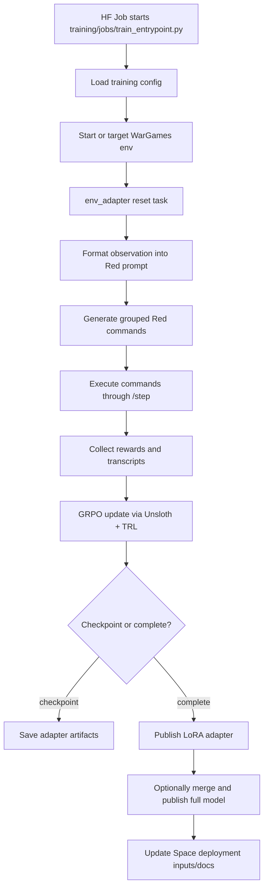
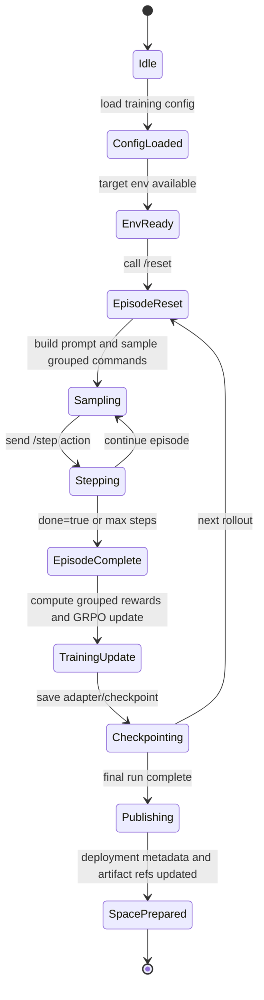

# WarGames Training Design

Date: 2026-04-25
Status: Draft for review
Owner: Navaneeth's Agent

## Goal

Extend WarGames with a self-contained `training/` package that can:

- run Red-agent GRPO training with Unsloth against the existing WarGames environment,
- launch training on Hugging Face Jobs,
- publish both a LoRA adapter and an optional merged model to Hugging Face Hub,
- and provide the deployment assets and documentation needed to run the demo and evaluation flow on Hugging Face Spaces.

The existing root environment remains the source of truth for the mesh, OpenEnv runtime, reward logic, and evaluation server. The new `training/` package owns the ML pipeline and deployment orchestration around that runtime.

## Non-Goals

- Re-implementing the WarGames environment inside `training/`
- Training Blue with RL
- Running long-lived GRPO training inside the interactive Hugging Face Space
- Replacing the existing FastAPI/OpenEnv server contract

## Current Baseline

The current repo already contains the core environment needed for training:

- root FastAPI/OpenEnv environment server
- raw bash Red action execution
- scripted Blue curriculum levels L0-L4
- Blue LLM showdown mode for evaluation
- dense per-step reward in `[0.0, 1.0]`
- task-based reset and step lifecycle

The major missing pieces are:

- GRPO-compatible rollout collection
- prompt and action formatting for training
- Unsloth + TRL training entrypoints
- Hugging Face Job execution path
- artifact publishing for adapter and merged model
- Space deployment metadata and usage path for trained artifacts

## Proposed Structure

```text
training/
  README.md
  config/
    training.base.yaml
    curriculum.l0-l4.yaml
    publish.yaml
    space.yaml
  prompts/
    red_system_prompt.txt
    red_task_templates/
  env_adapter/
    client.py
    observation_formatter.py
    action_parser.py
    task_selector.py
  rollouts/
    episode_runner.py
    sampler.py
    trajectory.py
    transcript_writer.py
  grpo/
    model.py
    trainer.py
    reward_adapter.py
    dataset.py
  jobs/
    train_entrypoint.py
    eval_entrypoint.py
    launch.md
  publish/
    push_adapter.py
    push_merged.py
    model_card.py
  spaces/
    README.template.md
    deployment.md
    runtime_env.md
  notebooks/
    colab_grpo.ipynb
  artifacts/
    .gitignore
```

## Ownership Boundaries

### Root repo owns

- `src/wargames_env/...`
- OpenEnv app contract and API endpoints
- mesh services and process management
- reward computation and Blue defender logic
- root Docker runtime for the environment

### `training/` owns

- prompt rendering for Red training
- env adapter over the existing server contract
- rollout sampling and transcript capture
- GRPO setup with Unsloth and TRL
- Hugging Face Job entrypoints and docs
- publishing adapter and merged artifacts
- Hugging Face Space deployment templates and trained-model usage docs

### Hard rule

No environment logic is duplicated in `training/`. The training package can adapt the root environment contract, but it cannot fork or shadow it.

## Architecture

### Component view

1. `training/env_adapter/client.py`
   Talks to the existing WarGames server through `/reset`, `/step`, and `/state`.

2. `training/env_adapter/observation_formatter.py`
   Converts the observation payload into a deterministic Red prompt for generation.

3. `training/env_adapter/action_parser.py`
   Converts model output into one valid bash command string.

4. `training/rollouts/episode_runner.py`
   Owns one episode lifecycle: reset, prompt, generate, step, capture reward, stop on done.

5. `training/rollouts/sampler.py`
   Produces grouped samples for GRPO from the same state/task context.

6. `training/grpo/reward_adapter.py`
   Maps the environment's per-step reward and episode summary into trainer-consumable rewards.

7. `training/grpo/trainer.py`
   Wires Unsloth model loading, LoRA config, TRL GRPO trainer config, rollout callbacks, checkpointing, and logging.

8. `training/jobs/train_entrypoint.py`
   The canonical batch entrypoint for Hugging Face Jobs.

9. `training/publish/*`
   Pushes adapter and merged exports, builds model cards, and records which base model and revision were used.

10. `training/spaces/*`
    Defines how the demo Space consumes the trained artifact and what metadata or secrets it requires.

### Flow diagram



## State Diagram



## Training Data Flow

### Prompt contract

Each rollout step uses three inputs:

- task descriptor from the selected curriculum level
- current observation from the environment
- recent command history already returned by the environment state or tracked in the rollout layer

The formatter outputs one text prompt that includes:

- Red role and objective
- current task name and Blue level
- key metrics snapshot
- process status summary
- recent command history
- last command output
- one explicit instruction: emit exactly one bash command

The prompt contract should be deterministic and plain-text first. Chat templating can wrap it later, but the semantic content should live in one canonical formatter.

### Action contract

Model output is parsed into exactly one command string.

Accepted output forms:

- raw single-line bash command
- structured output with a `command` field

Rejected output forms:

- multiple commands separated into plans
- explanations with no executable command
- multiline shell scripts in the first version

If parsing fails, the rollout layer emits a no-op fallback command and records a parse failure tag in the transcript. This keeps the trainer moving while making the failure visible in logs.

### Reward contract

The environment remains the source of truth for reward. The training layer does not recompute environment reward.

The GRPO adapter consumes:

- per-step `reward`
- `info.reward.total`
- optional component breakdown for logging only

Episode-level reward is the sum or discounted aggregation of step rewards, configurable in `training/config/training.base.yaml`. The first version should default to simple sum over the episode because the environment already emits normalized dense step reward.

## Curriculum Strategy

Training progresses over the existing scripted Blue levels, not the LLM showdown task.

Recommended progression:

1. warm up on `phase-2-blue-l0`
2. add `phase-2-blue-l1`
3. mix `phase-2-blue-l2`
4. mix `phase-2-blue-l3`
5. finish with `phase-2-blue-l4`

`phase-2-blue-llm-showdown` is evaluation-only.

Curriculum config should allow:

- fixed single-level training
- staged level progression by training step
- mixed sampling across levels with weights

The first version should implement staged progression because it is the simplest path that matches the project intent and avoids overcomplicating scheduling.

## Hugging Face Strategy

### Why Jobs + Space split

Training and demo are different workloads.

- Hugging Face Jobs: batch GPU training, checkpoints, artifact publishing
- Hugging Face Space: interactive demo/eval environment, transcript display, artifact consumption

This split keeps the Space responsive, avoids burning GPU time on an interactive service, and aligns with how the current environment is already packaged.

### Published artifacts

Primary outputs:

1. LoRA adapter repo
2. merged model repo

Recommended naming:

- `<org>/wargames-red-lora`
- `<org>/wargames-red-merged`
- `<org>/wargames-demo-space`

### Space consumption modes

Default mode:

- load base model plus adapter reference

Optional mode:

- load merged model directly

The Space docs must clearly state which mode it expects and what secrets or model access permissions are required.

## Error Handling

### Env unavailable

If the training job cannot reach the environment endpoint or the local runtime fails health checks:

- fail fast before trainer startup
- emit one clear connectivity diagnostic
- do not start GRPO with a fake dataset fallback

### Action parse failure

If generation does not yield a valid command:

- record the raw output
- issue one fallback no-op command
- mark the sample as parser-failed in the transcript

### Command timeout

If `/step` reports timeout:

- keep the reward supplied by the environment
- log timeout count separately
- do not retry within the same sample group

### Artifact publish failure

If adapter push succeeds and merged push fails:

- adapter repo remains the successful canonical output
- merged export is treated as optional follow-up
- failure is surfaced in the job summary

### Space deployment mismatch

If the Space is configured for merged-model inference but only an adapter exists:

- deployment docs must fail closed by telling the operator which artifact is missing
- no silent fallback to an untrained base model

## Testing and Verification

### Unit-level

- observation formatter outputs stable prompt sections
- action parser accepts valid forms and rejects invalid forms
- reward adapter maps environment responses correctly
- curriculum selector advances according to config

### Integration-level

- one local smoke rollout against the real environment
- one tiny GRPO smoke run with 1-2 rollout groups
- publish dry-run that validates repo names and metadata without pushing

### Deployment-level

- Hugging Face Job entrypoint runs from a clean checkout with config-only inputs
- generated Space metadata points to the correct app port and artifact repos

## Config Design

The first version should prefer YAML config over hardcoded constants for:

- base model name
- LoRA rank and target modules
- GRPO group size
- rollout count
- curriculum schedule
- checkpoint frequency
- adapter repo id
- merged repo id
- Space repo id

Environment variables should be reserved for secrets and runtime-specific overrides:

- `HF_TOKEN`
- optional custom API endpoints
- hardware-specific overrides where needed

## Security and Scope Controls

- training remains inside the isolated WarGames environment boundary
- no new host-level destructive privileges are introduced by the training package
- publishing only pushes configured repos and never guesses destination ids
- Space deployment docs must require explicit artifact references

## Key Tradeoffs

### Self-contained package vs root integration

Chosen: self-contained `training/` package with adapters.

Reason: it keeps RL and deployment concerns in one place without forking the environment runtime.

### Adapter + merged outputs vs adapter only

Chosen: both.

Reason: adapter is the practical training artifact, merged model is the convenient inference artifact. Treat adapter as canonical and merged as an export path.

### Jobs vs single GPU Space

Chosen: Hugging Face Jobs for training, Space for demo.

Reason: better workload separation, lower operational risk, and cleaner budget control.

## Implementation Sequence

1. create `training/` skeleton and config contract
2. implement env adapter and prompt formatter
3. implement action parser and rollout runner
4. add Unsloth + TRL GRPO trainer wiring
5. add Hugging Face Job entrypoint and docs
6. add publish scripts for adapter and merged outputs
7. add Space templates/docs for consuming trained artifacts
8. add notebook and smoke verification path

## Open Questions Resolved

- training lives in a top-level `training/` folder
- `training/` is a self-contained ML package with deployment assets
- Hugging Face Jobs handles training; Space handles demo/eval
- publishing produces both a LoRA adapter and a merged model

## Success Criteria

The design is successful when the repo can support the following flow without restructuring again:

1. start or target the existing WarGames environment
2. launch a Hugging Face Job that runs GRPO via Unsloth using `training/`
3. produce checkpoints and final adapter artifacts
4. optionally export and publish a merged model
5. configure a Hugging Face Space to consume the trained artifact for demo/eval

## Recommended Next Step

Write the implementation plan that decomposes this design into concrete file-by-file changes, verification commands, and ordering constraints.
